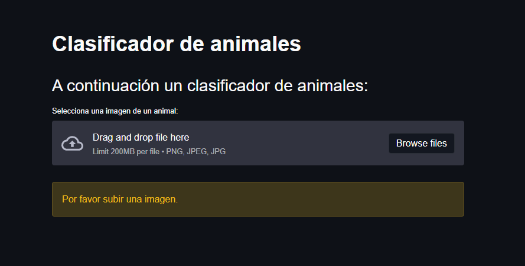
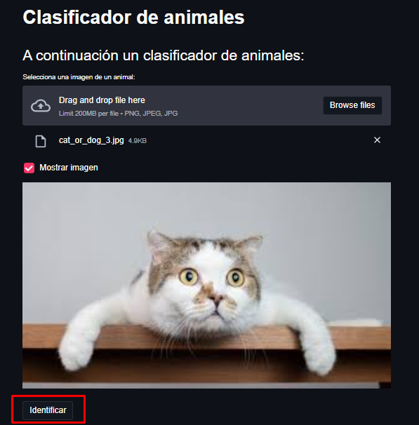
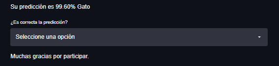

---

# Clasificador de animales

Utilizando una Red Neuronal Convolucional se creó un clasificador de animales.

Se creó una plataforma que permite cargar imágenes de animales y clasificarlas.
La plataforma tiene un sistema de feedback que permite al usuario verificar si la 
imagen fue clasificada correctamente.

---

## Construido del proyecto

Para este proyecto se utilizaron las siguientes herramientas:

* [Streamlit](https://streamlit.io/) - Framework web usado
* [Tensorflow](https://www.tensorflow.org/) - Librería para desarrollar modelos de ML.

---

## Instalación

Para iniciar el proyecto es necesario instalar las dependencias de la siguiente forma:

```
pip install -r requirements.txt
```

Al finalizar la instalación ejecutamos la aplicación con el siguiente comando:

```
streamlit run main.py
```

_Luego de iniciada la plataforma podrás predecir imágenes de animales._

---

## Probar la plataforma

Al iniciar la plataforma observaras la siguiente imagen donde podrás cargan la imagen 
de animal que desees predecir.



Luego de seleccionar la imagen que deseas predecir _(Yo he seleccionado la imagen de 
un lindo gatito)_ podrás presionar en el botón de identificar e iniciará el proceso de
clasificación.



Luego de clasificar la imagen, podrás dar un feedback del resultado obtenido.



_Repitiendo este proceso, podrá clasificar todas las imágenes que desee._

---

## Comentarios finales

* Actualmente el clasificador solo funciona con imágenes de perros y gatos, 
  se planea a futuro seguir entrenando el modelo para predecir otros tipos de
  animales.
  
* El mecanismo de feedback no guarda las nuevas imágenes dadas por el usuario, 
  se planea a futuro implementar un mejor mecanismo que permita almacenar las nuevas
  imágenes con sus respectivas etiquetas para mejorar el modelo.

---

## Autor

* **Argenis Gómez** - *Desarrollo del proyecto* - Github: [argenis-gomez](https://github.com/argenis-gomez)

---